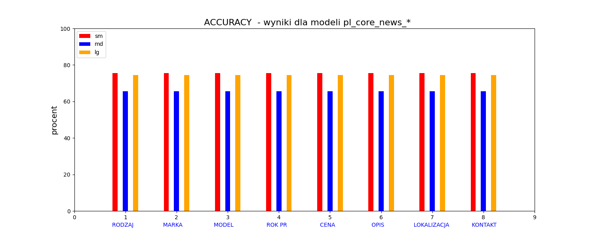
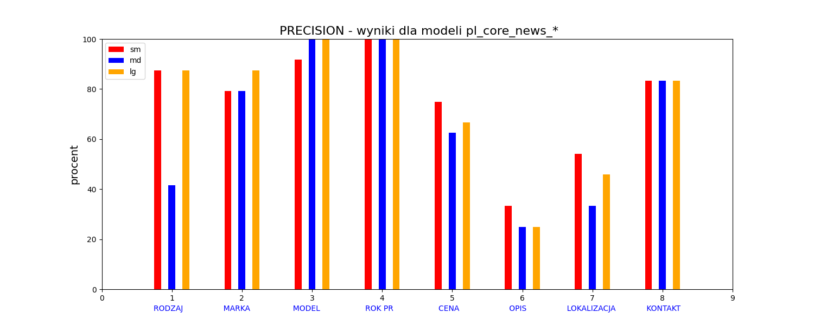
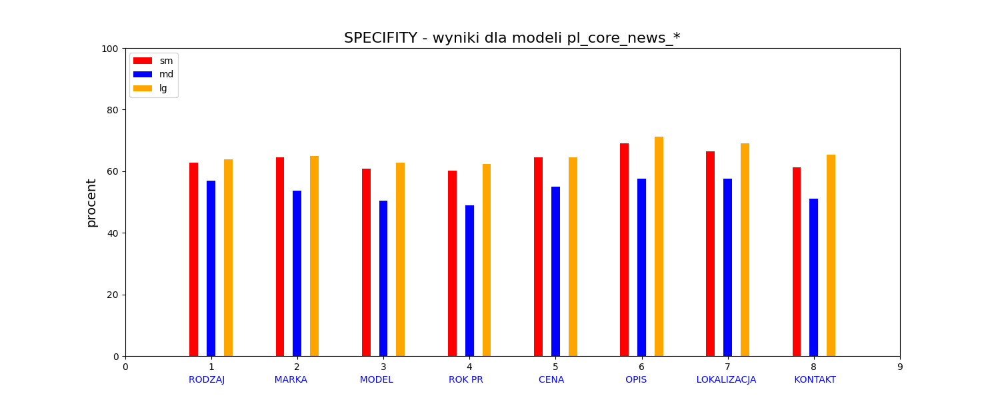

# Projekt na zaliczenie przedmiotu Przetwarzanie języka naturalnego

### Tytuł: Ekstrakcja informacji z ogłoszeń o samochodach
### Autor: Szymon Kwidzinski

## Cel projektu:
Celem projektu jest stworzenie programu do wydobywania kluczowych informacji z licznych
na rynku ogłoszeń o sprzedaży czy kupnie samochodów. Ogłoszenia o samochodach są 
w obecnych czasach poprzeplatane licznymi zdjęciami, reklamami, przepisami i różnymi
zbędnymi informacjami, więc stworzenie dużego zbioru treningowego z ogłoszeń było 
uciążliwe i bardzo pracochłonne. Natomiast trudno było znaleźć gotowy zbiór
treningowy w języku Polskim dla wybranych modeli.

## Opis projektu:
Do ekstrakcji informacji z ogłoszeń wykorzystane zostały trzy modele spaCy opracowane w języku
polskim autorstwa grupy Explosion: pl_core_news_sm-3.8.0 , pl_core_news_md-3.8.0 i pl_core_news_lg-3.8.0 .
Wykorzystana została bogata biblioteka spaCy i jej moduł Matcher, do którego dodane zostały potrzebne 
wzorce. Trudność sprawiło zdobycie odpowiednich ogłoszeń i przygotowanie odpowiedniego zbioru treningowego
oraz zbioru testowego. Wydobyte informacje dotyczyły takich kategorii jak: rodzaj ogłoszenia, marka 
samochodu, model samochodu, rok produkcji, cena, opis, lokalizacja i kontakt z właścicielem. Wyniki
przetworzenia zostały zestawione w tabelce oraz na odpwiednich diagramach, a także zapisane do pliku 'wyniki.csv'.

## Wykresy

## Język kodu:
Python 3.12

## Biblioteki:
(również zawarte w pliku requirements.txt)
* torch
* numpy
* matplotlib
* sys
* spaCy
* csv
* pip
* wget
* os

## Uruchomienie:
Po ściągnięciu kodu, modułów i załadowaniu powyższych bibliotek, wystarczy
uruchomić kod w środowisku Python. Program jest interaktywny przez liczne 
zapytania o np. kontynuację, wybór modelu oraz wyświetlanie wykresów i tabel. Kod będzie zatrzymywał się
na kolejnych diagramach i wznawiał działanie po zamknięciu diagramu. Diagramy na końcu programu można wyświetlić,
wtedy zostaną one automatycznie zapisane na dysku w folderze "wykresy",
wyniki przetwarzania są zapisywane w pliku wyniki.csv niezależnie od wyboru wyświetlenia.

## Źródła i inspiracje : 
* materiały z przedmiotu PJN
* ["Polish · spaCy Models Documentation"](https://spacy.io/models/pl) autorstwa grupy Explosion
* [„Language · spaCy API Documentation”](https://spacy.io/api/language)
* ["Linguistic Features · spaCy Usage Documentation"]( https://spacy.io/usage/linguistic-features)
* ["Language Processing Pipelines"](https://spacy.io/usage/processing-pipelines)
* ["Models & Languages · spaCy Usage Documentation"](https://spacy.io/usage/models)
* ["Rule-based matching · spaCy Usage Documentation"](https://spacy.io/usage/rule-based-matching)
* ["Miary oceny jakości klasyfikacji"](https://kssk.gitbook.io/msi/1.-klasyfikacja-jako-przyklad-rozpoznawania-wzorcow)
* matplotlib.pyplot — Matplotlib 3.5.3 documentation 
